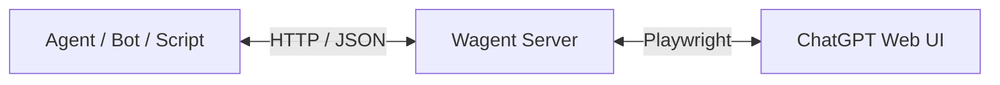

# Wagent - Web-Agent Bridge for ChatGPT


**Wagent** は、Web版 ChatGPT を **あたかも API のように扱う** ためのブリッジサーバーです。

Playwright によるブラウザ自動化を用いて Web UI にログイン・セッションを維持し、
外部のエージェントやプログラムから HTTP 経由で ChatGPT を操作できます。

> ⚠️ 本プロジェクトは研究・個人利用向けです。商用利用や大規模運用は推奨されません。

---

## ✨ 特徴

* 🌐 **Web版 ChatGPT を API 的に利用**
* 🔐 **ログイン状態を永続化**（再ログイン不要）
* 🧠 **会話コンテキストを維持 / リセット可能**
* 🕹 **対話モード + API サーバーモード両対応**
* ⚙️ **FastAPI ベースで拡張しやすい設計**
* 🧪 **Playwright による堅牢な UI 操作**

---

## 🎯 全体構成



* **Agent**: curl / Python / Bot / 自作クライアント
* **Wagent**: セッション管理 + UI 操作 + API 提供
* **ChatGPT Web UI**: 実際に操作されるブラウザ

---

## 📦 インストール

### 1️⃣ リポジトリをクローン

```bash
git clone https://github.com/nezumi0627/Wagent.git
cd Wagent
```

### 2️⃣ Python 依存関係のインストール

```bash
pip install -r requirements.txt
```

### 3️⃣ Playwright ブラウザのセットアップ

```bash
playwright install chromium
```

---

## 🚀 使い方

### 🔑 初回ログイン（対話モード）

初回は **手動ログインが必須** です。

```bash
python -m wagent.main --interactive
```

手順:

1. Chromium ブラウザが起動
2. ChatGPT にログイン
3. コンソールで Enter を押す
4. 対話モードで送信テスト

ログイン情報は `browser_data/` に保存されます。

---

### 🖥 API サーバーモード

ログイン完了後は API サーバーとして起動できます。

```bash
python -m wagent.main --server
```

カスタム設定:

```bash
python -m wagent.main --server --host 0.0.0.0 --port 8765
```

---

## 📡 API エンドポイント

| Method | Path             | Description     |
| ------ | ---------------- | --------------- |
| POST   | `/v1/chat`       | メッセージ送信 & 応答取得  |
| GET    | `/v1/status`     | ログイン状態・ブラウザ生存確認 |
| DELETE | `/v1/session`    | 会話コンテキストのリセット   |
| GET    | `/v1/screenshot` | 現在のブラウザ画面を取得    |
| GET    | `/health`        | ヘルスチェック         |

---

## 📤 API 使用例

### メッセージ送信

```bash
curl -X POST http://127.0.0.1:8765/v1/chat \
  -H "Content-Type: application/json" \
  -d '{"message": "Hello, ChatGPT!", "new_conversation": false}'
```

### ステータス確認

```bash
curl http://127.0.0.1:8765/v1/status
```

### 会話リセット

```bash
curl -X DELETE http://127.0.0.1:8765/v1/session
```

---

## 🐍 Python クライアント

```python
from wagent.client import WagentClient, ask_chatgpt

client = WagentClient()

status = client.status()
print("Logged in:", status["logged_in"])

res = client.chat("Pythonでフィボナッチ数列を書いて")
print(res["message"])

res = client.chat("新しい話題です", new_conversation=True)

answer = ask_chatgpt("1+1は？")
print(answer)
```

---

## ⚙️ 設定ファイル

### `config/settings.yaml`

```yaml
browser:
  headless: false
  user_data_dir: "./browser_data"

rate_limit:
  requests_per_minute: 10
  min_interval: 3
```

### `config/selectors.yaml`

ChatGPT の DOM 構造変更に対応するための CSS セレクタ定義です。
UI 変更時はここを修正してください。

---

## 📁 ディレクトリ構成

```
Wagent/
├── config/
├── wagent/
│   ├── browser.py
│   ├── server.py
│   ├── client.py
│   └── main.py
├── browser_data/
├── logs/
├── screenshots/
├── requirements.txt
└── README.md
```

---

## ⚠️ 注意事項（重要）

> **本ソフトウェアは完全に自己責任で使用してください。**

1. **責任の所在**
   本プロジェクトの作者・コントリビューターは、本ソフトウェアの使用・不使用・使用不能によって生じたいかなる損害（直接的・間接的・偶発的・特別・結果的損害を含む）についても、一切の責任を負いません。

2. **利用規約・法令の遵守**
   利用者は、関連するすべての利用規約・契約・法令・ガイドラインを自身で確認し、遵守する責任を負います。本ソフトウェアは、特定のサービスや規約への適合性を保証するものではありません。

3. **非公式・無保証**
   本ソフトウェアは公式 API や公式サポートではありません。動作の継続性、正確性、可用性は保証されず、予告なく動作不能になる可能性があります。

4. **アカウント・データの管理**
   ログイン情報やセッションデータ（`browser_data/` など）の管理は利用者の責任です。第三者への共有、公開リポジトリへのコミット等は行わないでください。

5. **負荷・運用**
   過度な自動化、短時間での大量リクエスト、常時稼働運用は推奨されません。利用者は自身の運用が及ぼす影響を考慮してください。

---

## 🛣 今後の予定（Ideas）

* ストリーミング応答対応
* マルチセッション対応
* プラグイン / Agent フック機構
* Docker 対応

---

## 📜 ライセンス

MIT License

---

> Created & Maintained by **nezumi0627**
