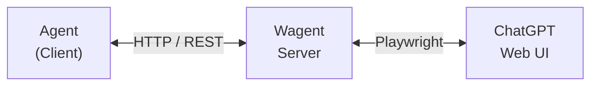

# Wagent - Web-Agent Bridge for ChatGPT


**Wagent**はWeb版ChatGPTを「API」のように扱い、自作のエージェントから呼び出すためのブリッジツールです。

## 🎯 概要

Playwrightによるブラウザ自動化技術を駆使して、Web UIの背後でセッションを維持し、命令の中継を行う「プロキシ・ゲートウェイ」として機能します。



## 📦 インストール

### 1. 依存パッケージのインストール

```bash
pip install -r requirements.txt
```

### 2. Playwrightブラウザのインストール

```bash
playwright install chromium
```

## 🚀 使い方

### 対話モード（初回ログイン用）

初回はブラウザが開き、ChatGPTに手動でログインする必要があります：

```bash
python -m wagent.main --interactive
```

1. ブラウザウィンドウが開きます
2. ChatGPTにログインしてください
3. コンソールでEnterを押すと対話モードが開始
4. プロンプトを入力してテスト

### APIサーバーモード

ログイン後は、APIサーバーとして起動できます：

```bash
python -m wagent.main --server
```

または

```bash
python -m wagent.main --server --host 0.0.0.0 --port 8765
```

## 📡 API エンドポイント

| メソッド | パス | 説明 |
|---------|------|------|
| `POST` | `/v1/chat` | メッセージを送信し、回答を待機して返す |
| `GET` | `/v1/status` | ブラウザ生存確認とログイン状態チェック |
| `DELETE` | `/v1/session` | 新しいチャットを開始（コンテキストリセット） |
| `GET` | `/v1/screenshot` | デバッグ用スクリーンショット |
| `GET` | `/health` | ヘルスチェック |

### リクエスト例

```bash
# メッセージ送信
curl -X POST http://127.0.0.1:8765/v1/chat \
  -H "Content-Type: application/json" \
  -d '{"message": "Hello, ChatGPT!", "new_conversation": false}'

# ステータス確認
curl http://127.0.0.1:8765/v1/status

# セッションリセット
curl -X DELETE http://127.0.0.1:8765/v1/session
```

## 🐍 Pythonクライアント

```python
from wagent.client import WagentClient, ask_chatgpt

# クライアントを使用
client = WagentClient()

# ステータス確認
status = client.status()
print(f"Logged in: {status['logged_in']}")

# メッセージ送信
response = client.chat("Pythonでフィボナッチ数列を計算するコードを書いてください")
print(response["message"])

# 新しい会話を開始してから質問
response = client.chat("別のトピックです", new_conversation=True)

# ワンショット関数
answer = ask_chatgpt("1+1は?")
print(answer)
```

## ⚙️ 設定

### config/settings.yaml

```yaml
browser:
  headless: false  # ヘッドレスモード
  user_data_dir: "./browser_data"  # ログイン状態を保存

rate_limit:
  requests_per_minute: 10  # 1分あたりの最大リクエスト
  min_interval: 3  # リクエスト間の最小間隔（秒）
```

### config/selectors.yaml

Web UIのHTML構造が変更された場合、ここのセレクタを更新してください。

## 📁 プロジェクト構造

```
Wagent/
├── config/
│   ├── settings.yaml     # アプリケーション設定
│   └── selectors.yaml    # CSSセレクタ（保守用）
├── wagent/
│   ├── __init__.py
│   ├── browser.py        # ブラウザコントローラー
│   ├── client.py         # APIクライアント
│   ├── config.py         # 設定ローダー
│   ├── main.py           # エントリーポイント
│   ├── schemas.py        # APIスキーマ
│   └── server.py         # FastAPIサーバー
├── browser_data/         # ブラウザセッション保存
├── logs/                 # ログファイル
├── screenshots/          # デバッグ用スクリーンショット
├── requirements.txt
└── README.md
```

## ⚠️ 注意事項

1. **利用規約**: Web UIの自動操作はOpenAIの利用規約に抵触する可能性があります。個人利用の範囲に留め、過度な負荷をかけないでください。

2. **レートリミット**: デフォルトで1分あたり10リクエストに制限されています。

3. **セッション維持**: `browser_data` ディレクトリにログイン情報が保存されます。共有しないでください。

## 📜 ライセンス

MIT License
