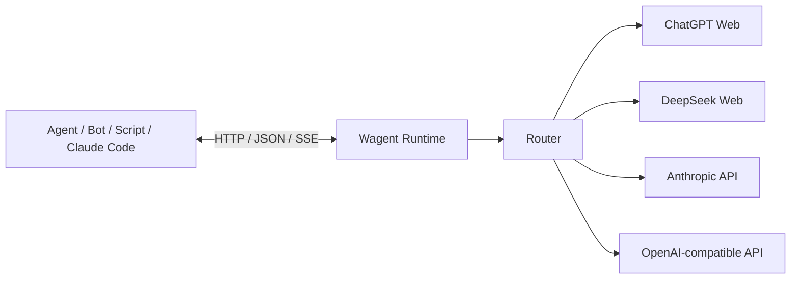

# Wagent - Web-Agent Bridge & AI Runtime


**Wagent** は、Web版 ChatGPT などの AI サービスを **あたかも API のように扱う** ために始まった Web-Agent Bridge です。

現在の Wagent は、その思想をそのまま広げ、ChatGPT Web / DeepSeek Web / Anthropic / OpenAI互換API / ローカルモデルなどを、ひとつの共通インターフェースから扱える **軽量なマルチプロバイダ AI Runtime** へ進化しています。

Playwright によるブラウザ自動化、API Provider、セッション管理、Skills、共通イベント、OpenAI / Anthropic 互換APIをまとめ、外部のエージェントやプログラムから HTTP や CLI 経由で AI を操作できます。

> ⚠️ Web Provider は研究・個人利用を主目的としています。第三者サービスの利用規約・法令・アカウントポリシーを確認し、自己責任で利用してください。

---

## ✨ 特徴

- 🌐 **Web版 ChatGPT / DeepSeek を API 的に利用**
- 🔌 **Anthropic / OpenAI互換 Provider に対応**
- 🔐 **ブラウザのログイン状態を永続化**
- 🧠 **会話コンテキスト / セッションを維持**
- 🧩 **Providerを差し替え可能なマルチプロバイダ設計**
- 🛠 **Tools / Skills を Provider から分離**
- 📡 **Wagent Native / OpenAI / Anthropic 互換API**
- 🌊 **ストリーミング応答を共通イベントへ正規化**
- 🤖 **`AGENTS.md` / `CLAUDE.md` / `SKILL.md` を備えたAIフレンドリーな構成**
- 🕹 **対話CLI + APIサーバーモード両対応**
- ⚡ **Bun + TypeScript による軽量なRuntime**

---

## 🎯 全体構成


```mermaid
flowchart LR
    Agent["Agent / Bot / Script / Claude Code"]
    Wagent["Wagent Runtime"]
    Router["Router"]

    ChatGPT["ChatGPT Web"]
    DeepSeek["DeepSeek Web"]
    Anthropic["Anthropic API"]
    OpenAI["OpenAI-compatible API"]

    Agent <-->|HTTP / JSON / SSE| Wagent
    Wagent --> Router
    Router --> ChatGPT
    Router --> DeepSeek
    Router --> Anthropic
    Router --> OpenAI
```

- **Agent**: curl / Bot / Claude系クライアント / OpenAI SDK / 自作クライアント
- **Wagent**: セッション管理 + Skills + ルーティング + 共通イベント + API提供
- **Provider**: ChatGPT Web / DeepSeek Web / Anthropic / OpenAI互換サービスなど
- **Web Provider**: Playwrightを利用して実際のWeb UIを操作

内部の依存方向はシンプルに保ちます。

```text
Agent / App
    ↓
Wagent Runtime
    ↓
Router
    ↓
Provider
    ↓
Transport / Browser / HTTP
```

Provider固有の処理をRuntimeへ持ち込まず、すべてのProviderは共通の `WagentEvent` を返します。

---

## 📦 インストール

### 1️⃣ リポジトリをクローン

```bash
git clone https://github.com/nezumi0627/Wagent.git
cd Wagent
```

### 2️⃣ 依存関係をインストール

```bash
bun install
```

### 3️⃣ 起動

```bash
bun run start
```

デフォルトでは `127.0.0.1:8765` で起動します。

---

## 🚀 使い方

### 🔑 Web Provider の初回ログイン

ChatGPT Web / DeepSeek Web を利用する場合、初回はブラウザ上での **手動ログインが必要** です。

```bash
bun run cli
```

手順:

1. Wagent から Web Provider を選択
2. Chrome / Edge が起動
3. 対象サービスへログイン
4. ログイン済みブラウザプロファイルを Wagent が保持
5. 以降は同じプロファイルを再利用

ブラウザプロファイルやセッション情報は原則 `~/.wagent/` 以下に保存され、Gitには含まれません。

---

### 🖥 API サーバーモード

```bash
bun run start
```

カスタム設定:

```bash
WAGENT_HOST=0.0.0.0 WAGENT_PORT=8765 bun run start
```

---

### 🕹 対話モード

```bash
bun run cli
```

CLIからProvider / Modelを切り替えて対話できます。

---

## 🔌 対応 Provider

### ChatGPT Web

元のWagentの中心機能です。

```text
chatgpt-web/default
```

ブラウザログイン、会話継続、ファイル、Web検索などをProvider内部へ閉じ込めています。

### DeepSeek Web

`deepseek-web-harness` の実装・知見をWagentのProvider構造へ統合しています。

```text
deepseek-web/default
```

DeepThink、検索、ファイル、会話継続など、Web UIで利用可能な機能をCapabilityとして公開します。

### Anthropic

Anthropic Messages APIを直接利用できます。

```bash
export WAGENT_ANTHROPIC_API_KEY=...
```

```text
anthropic/<model-id>
```

### OpenAI-compatible

OpenAI、OpenRouter、Ollama、LM Studio、vLLMなど、OpenAI互換APIを同じProviderから接続できます。

```bash
export WAGENT_OPENAI_BASE_URL=https://api.openai.com/v1
export WAGENT_OPENAI_API_KEY=...
```

```text
openai-compatible/<model-id>
```

---

## 📡 API エンドポイント

| Method | Path | Description |
| --- | --- | --- |
| GET | `/health` | ヘルスチェック |
| GET | `/v1/status` | Wagent / Provider / Session 状態 |
| GET | `/v1/providers` | Provider一覧 |
| GET | `/v1/models` | Model一覧 |
| GET | `/v1/skills` | Skill一覧 |
| POST | `/v1/generate` | Wagent Native API |
| POST | `/v1/chat` | 旧Wagent互換の簡易Chat API |
| POST | `/v1/chat/completions` | OpenAI Chat Completions互換 |
| POST | `/v1/messages` | Anthropic Messages互換 |

---

## 📤 API 使用例

### 元Wagent風の簡単なメッセージ送信

```bash
curl.exe -X POST "http://127.0.0.1:8765/v1/chat" \
  -H "Content-Type: application/json" \
  -d '{"message":"Hello, ChatGPT!","model":"chatgpt-web/default"}'
```

### Wagent Native API

```bash
curl.exe -X POST "http://127.0.0.1:8765/v1/generate" \
  -H "Content-Type: application/json" \
  -d '{"model":"deepseek-web/default","messages":[{"role":"user","content":"こんにちは"}]}'
```

### Anthropic Messages互換

```bash
curl.exe -X POST "http://127.0.0.1:8765/v1/messages" \
  -H "Content-Type: application/json" \
  -H "anthropic-version: 2023-06-01" \
  -d '{"model":"claude-sonnet-4-5","max_tokens":512,"messages":[{"role":"user","content":"Hello from Wagent"}]}'
```

### OpenAI互換

```bash
curl.exe -X POST "http://127.0.0.1:8765/v1/chat/completions" \
  -H "Content-Type: application/json" \
  -d '{"model":"openai-compatible/gpt-5","messages":[{"role":"user","content":"Hello"}]}'
```

---

## 🤖 AI / Agent 向け

Wagentは、人間だけでなくCoding Agent自身が理解・改造しやすいリポジトリを目指しています。

AIがWagentを編集するときは、まず以下を読みます。

```text
AGENTS.md
   ↓
CLAUDE.md (Claude系の場合)
   ↓
docs/architecture.md
   ↓
変更対象のpackage
   ↓
関連するskills/*/SKILL.md
```

Provider固有コードをRuntimeへ漏らさず、AIが変更範囲を狭く判断できる構成にしています。

### Skills

```text
skills/
├── concise/
├── claude/
└── wagent-contributor/
```

`SKILL.md` は単なるドキュメントではなく、Wagent Runtimeから読み込み・選択できる第一級機能です。

---

## 📁 ディレクトリ構成

```text
Wagent/
├── apps/
│   ├── cli/
│   └── server/
├── packages/
│   ├── provider-sdk/
│   ├── runtime/
│   ├── skills/
│   └── providers/
│       ├── chatgpt-web/
│       ├── deepseek-web/
│       ├── anthropic/
│       └── openai-compatible/
├── skills/
├── docs/
├── tests/
├── AGENTS.md
├── CLAUDE.md
├── CONTRIBUTING.md
└── README.md
```

---

## ⚠️ 注意事項（重要）

> **本ソフトウェアは完全に自己責任で使用してください。**

1. **責任の所在**  
   本プロジェクトの作者・コントリビューターは、本ソフトウェアの使用・不使用・使用不能によって生じたいかなる損害（直接的・間接的・偶発的・特別・結果的損害を含む）についても、一切の責任を負いません。

2. **利用規約・法令の遵守**  
   利用者は、関連するすべての利用規約・契約・法令・ガイドラインを自身で確認し、遵守する責任を負います。本ソフトウェアは、特定のサービスや規約への適合性を保証するものではありません。

3. **非公式・無保証**  
   Web Providerは公式 API や公式サポートではありません。第三者Web UIの変更によって、予告なく動作不能になる可能性があります。

4. **アカウント・データの管理**  
   ログイン情報、Cookie、API Key、ブラウザプロファイル、セッションデータの管理は利用者の責任です。第三者への共有、公開リポジトリへのコミット等は行わないでください。

5. **負荷・運用**  
   過度な自動化、短時間での大量リクエスト、第三者サービスへ過剰な負荷を与える運用は推奨されません。

---

## 🛣 今後の予定（Ideas）

- MCP Runtime / MCP Tool連携
- Tool SDK
- Provider Plugin自動Discovery
- Memory / Context Store
- Retry / Fallback / Circuit Breaker
- コスト・速度・Capabilityを考慮したAuto Router
- Gemini / その他Provider
- Agent Loop
- Multi-Agent
- Docker対応
- より強いOpenAI / Anthropic互換性

---

## 🧪 開発

```bash
bun install
bun run check
```

`bun run check` はTypeScriptの型チェックとテストを実行します。

Wagentへのコントリビュートに興味を持ってくれてありがとうございます。詳細は `CONTRIBUTING.md` と `AGENTS.md` を参照してください。

---

## 📜 ライセンス

MIT License

DeepSeek Web Providerには、MIT Licenseで公開されている `nezumi0627/deepseek-web-harness` の実装・知見を統合しています。詳細は `THIRD_PARTY_NOTICES.md` を参照してください。

---

> Created & Maintained by **nezumi0627**
